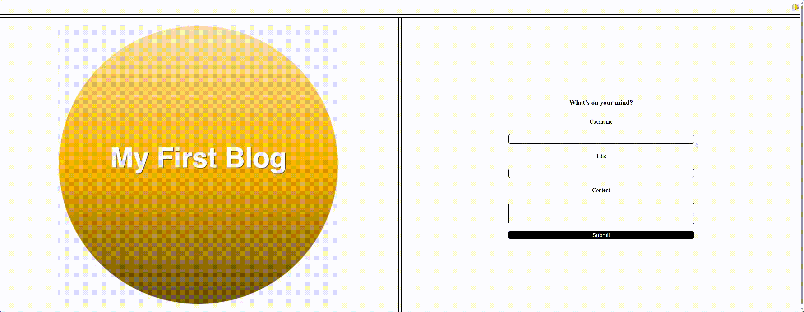

# Blog Post Application
A simple blog post application that allows users to create blog posts, view them, and toggle between light and dark modes.

## Overview
This project is a basic blog post application. Users can submit blog posts, which are then stored in the browser's localStorage. The application supports dark and light modes, and users can toggle between these modes. There are two main pages: the landing page for submitting blog posts and the posts page for viewing submitted posts.

## Mock-Up

## Features
- Submit blog posts with a username, title, and content.
- Store blog posts in localStorage.
- View a list of submitted blog posts.
- Toggle between dark and light modes.
- Responsive design for various screen sizes.

## Technologies Used
* HTML
* CSS
* JavaScript

## Installation
There is no installation needed. To access the website [here](https://lolrb.github.io/BlogPost/)

## Usage
1. Landing Page:

* Fill out the username, title, and content fields.
* Click the "Submit" button to save the blog post.
* If any fields are empty, an error message will prompt you to complete the form.

2. Posts Page:

* View the list of submitted blog posts.
* Use the "Back" button to return to the landing page.
* Toggle between dark and light modes using the button in the header.

## Acknowledgements
This project was created as part of a learning exercise and may contain simplistic implementations.